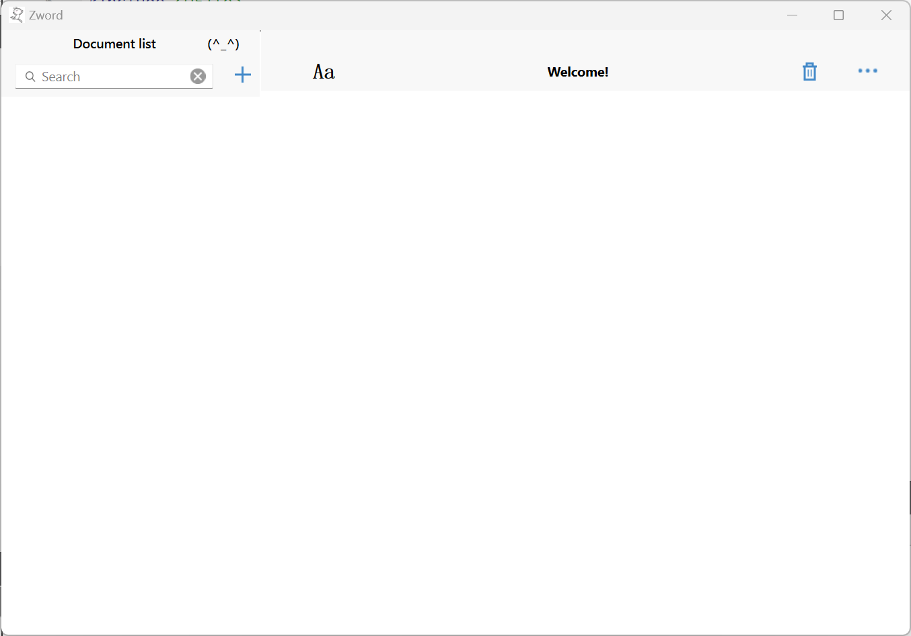
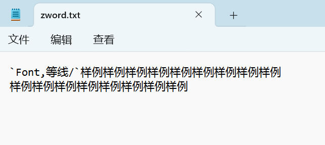
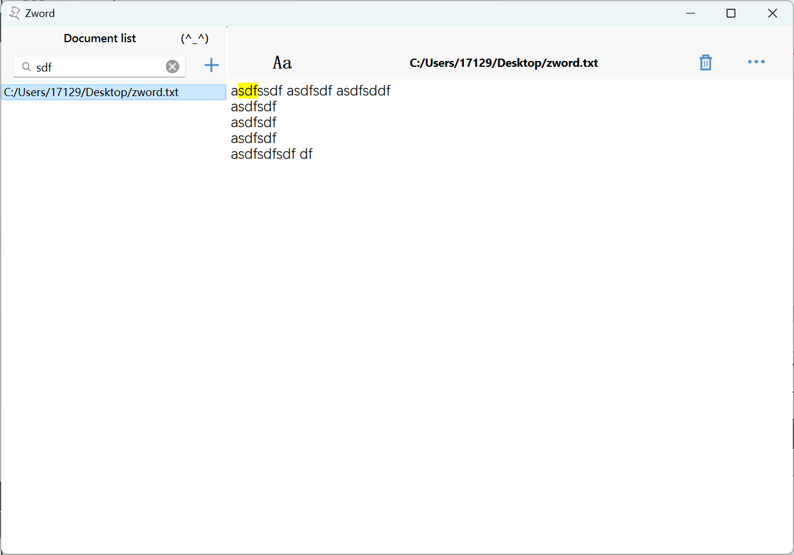
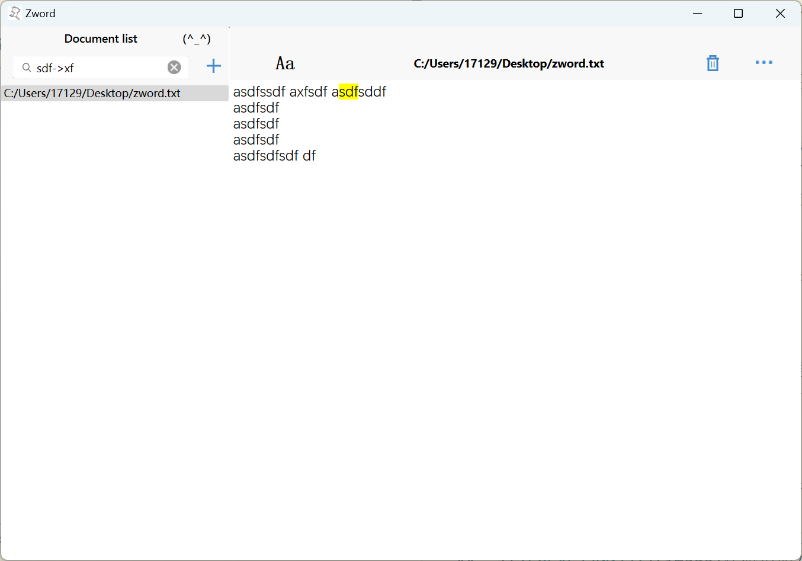
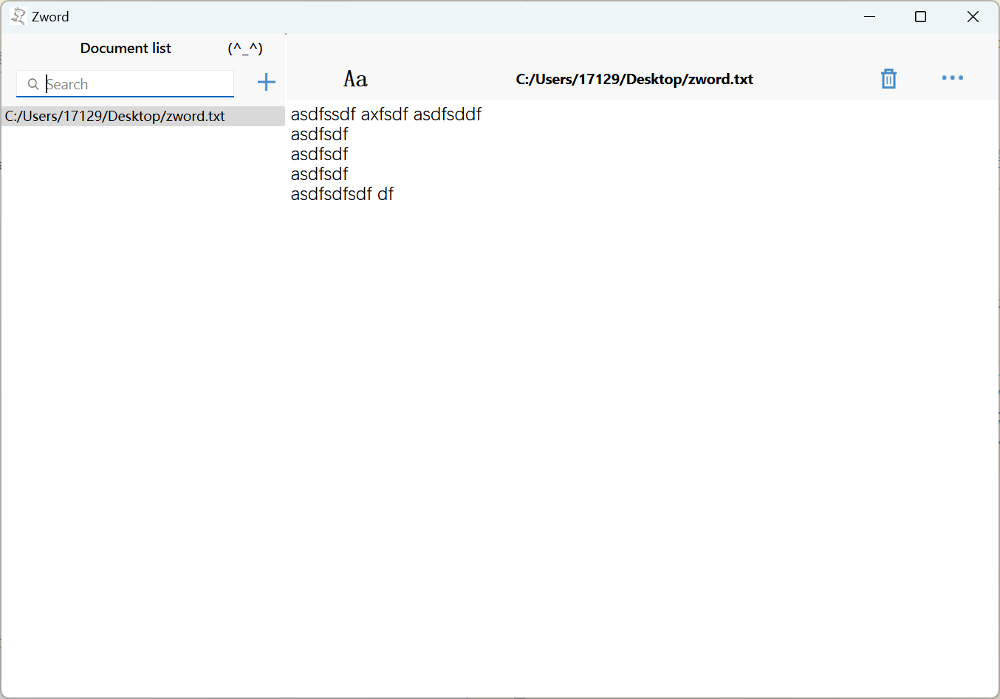

### 代码说明  
勉强来写一个使用说明  
代码写的很丑陋，并不是很优雅。90%其实都是在调函数操作。  

主要的界面分为两个部分：左边是打开的文件列表，右边是文本输入区域  

#### 文本基本操作  
- 打开文本使用快捷键`Ctrl+O`，只能打开已有文本  

- 新建文本使用左上角的‘+’号，或者使用快捷键`Ctrl+N`  

- 保存文本使用快捷键`Ctrl+S` 

- 同其他文本编辑器一样，无法删除本地文本文件。若要删除当前打开的文本，可以点击右上角垃圾桶按钮或者使用快捷键`Ctrl+D`

- 文本的撤销使用快捷键`Ctrl+Z`，或者右键文本区选择`Undo`
- 文本取消撤销使用快捷键`Ctrl+Y`，或者右键文本区选择`Redo`  

- 文本的复制使用快捷键`Ctrl+C`，或者右键文本区选择`Copy`
- 文本的粘贴使用快捷键`Ctrl+V`，或者右键文本区选择`Paste`
- 文本的全选使用快捷键`Ctrl+A`，或者右键文本区选择`Select All`

#### 文本格式操作
- 在文字的前后加上`#`号，再使用`Ctrl+S`进行保存即可使`#`中间文本加粗。（带`#`的格式会保存到txt文本文件中，再次打开依然会显示该格式）

- 在文字的前后加上`~`号，再使用`Ctrl+S`进行保存即可使`~`中间文本斜体。（带`~`的格式会保存到txt文本文件中，再次打开依然会显示该格式）

- c++关键字能够高亮显示（格式不会保存到txt文本文件中）

- 对网址按住`Ctrl`键点击，能够使用默认浏览器访问该网址

- txt原始文本开始进行了格式设置

- 使用中间的`A`按键可以选择文本字体，选择的字体会保存到txt文本文件中，再次打开也会显示该字体。

- 文本设置为一行最多64个字符，如果调整窗口大小，可以看到文本能够自动缩进  

- 使用最右上角的三个点按键，能够清楚当前文本的所有格式，但只能在打开文本时点击。

#### 查找替换功能  
在左上角的`Search`中输入文本后，通过使用快捷键`Ctrl+F`可以实现查找功能，查找到的文本高亮显示。再次使用`Ctrl+F`能够锁定下一个目标，当没有下一个目标时最后一行高亮显示。

在`Search`中输入`查找内容->替换内容`，再使用快捷键`Ctrl+H`可以实现替换。再次使用`Ctrl+H`能够锁定下一个目标进行替换

结束查找替换操作后，点击左上角的`X`，能够结束，并继续编辑。

点击结束的`X`按键后，按键会消失哦

#### 大文本输入的处理  
通过保存格式为单行，如果进行小修改，会找到修改行并只改变修改行及以下的内容，能够实现快速保存处理。

